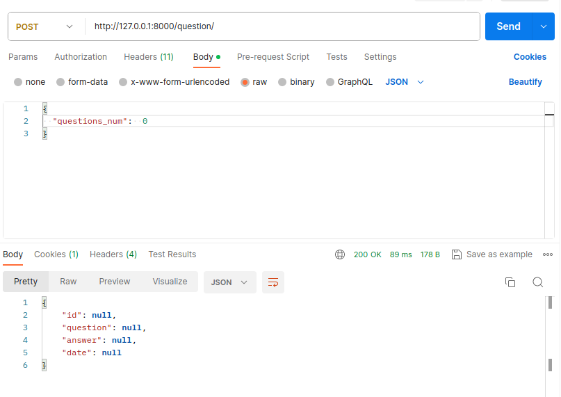
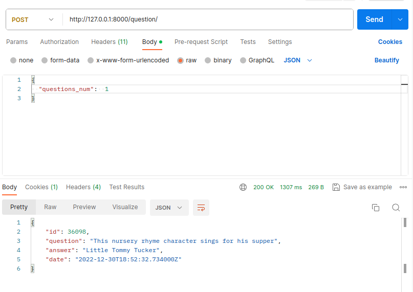
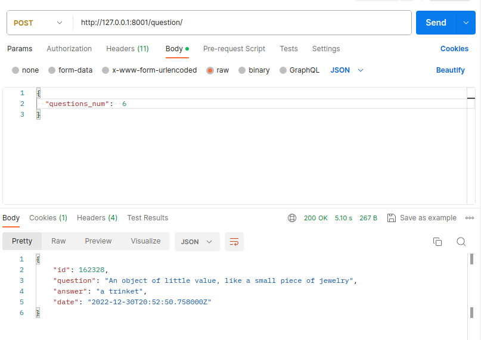

# easy_web  
## Main Info  
The following technologies have been used in this project:  
python3  
postgresql  
sqlaclhemy  
alembic  
fastapi  
postman  
pgadmin4  
docker  
docker-compose  
makefile  
jinja2  
uvicorn  
psycopg2  
pydantic  
asyncpg  
httpx  

## FastApi docs  

You can review the documentation for the functions and test them in the built-in FastAPI documentation at the following link:  
* http://localhost:8000/docs  
 
*The application should be running.*  

## Build and start project  

U can build and start project only with one command in main dir(easy_web):  
* make
  *if troubles: u can use next command 'sudo make build2 && sudo make up'*   

## Tests  
  
  
  
